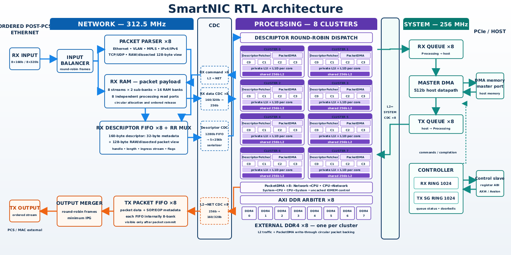
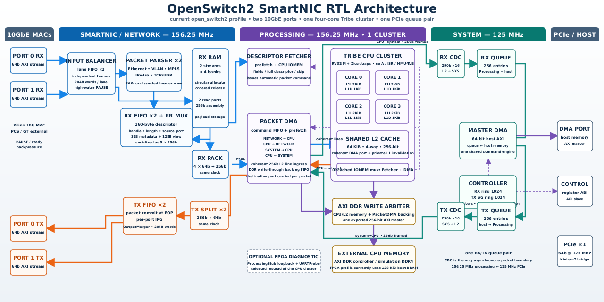

# SmartNIC
Modern C++ architecture of 400G-800G Ethernet SmartNIC based on an own optimized RISC-V CPU developed with cpphdl tool

Principal:

Current 400G/800G design:

2x10G SmartNIC (branch open_switch2):

